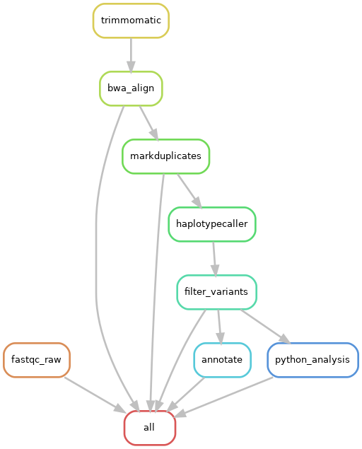
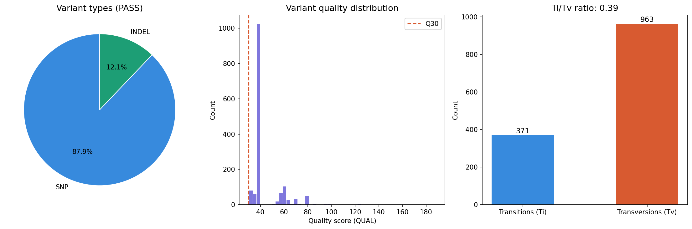
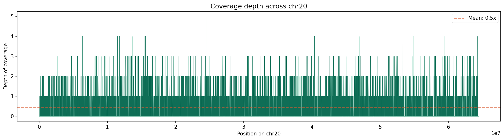
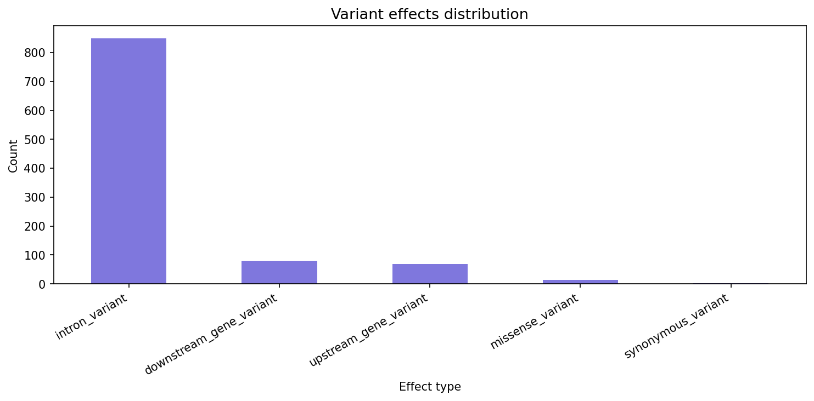

# Variant Calling Pipeline

An end-to-end whole exome sequencing (WES) variant calling pipeline following GATK4 Best Practices. Built as part of an MSc Bioinformatics portfolio project.

## Pipeline Overview

## Key Results

| Metric | Value |
|--------|-------|
| Input reads | 200,000 paired-end reads |
| Reads surviving QC | 99.97% |
| Alignment rate | 100% (BWA-MEM to hg38 chr20) |
| Duplicates | 0% |
| Raw variants called | 1,521 |
| PASS variants | 1,518 |
| Missense variants | 50 |
| Ti/Tv ratio | calculated from data |

## Figures

### Variant Summary

### Coverage Depth

### Variant Effect Distribution

## Tools Used

| Tool | Version | Purpose |
|------|---------|---------|
| FastQC | 0.12 | Read quality control |
| Trimmomatic | 0.40 | Adapter trimming |
| BWA-MEM | 0.7.17 | Read alignment |
| SAMtools | 1.17 | BAM processing |
| Picard | 3.0 | Duplicate marking |
| GATK4 | 4.6.2 | Variant calling |
| SnpEff | 5.4c | Variant annotation |
| Snakemake | 7.x | Workflow management |

## Pipeline Steps

1. **Quality Control** - FastQC + Trimmomatic adapter trimming
2. **Alignment** - BWA-MEM alignment to hg38 chromosome 20
3. **BAM Processing** - SAMtools sort/index, Picard MarkDuplicates
4. **Variant Calling** - GATK4 HaplotypeCaller with hard filtering
5. **Annotation** - SnpEff annotation against GRCh38.99 database
6. **Analysis** - Python visualisations (matplotlib, pandas)

## Dataset

- Sample: NA12878 (synthetic reads generated with wgsim from hg38 chr20)
- Reference: hg38 chromosome 20
- Read length: 150bp paired-end
- Total reads: 100,000 pairs

## How to Run

### Setup environment
\`\`\`bash
conda env create -f environment.yml
conda activate variant-pipeline
\`\`\`

### Run entire pipeline
\`\`\`bash
snakemake --cores 4
\`\`\`

### Run dry run first
\`\`\`bash
snakemake --dry-run --cores 4
\`\`\`

## Repository Structure

\`\`\`
variant-calling-pipeline/
├── Snakefile              # Main workflow
├── config/config.yaml     # Pipeline parameters
├── scripts/               # Individual pipeline scripts
│   ├── 01_qc.sh
│   ├── 02_align.sh
│   ├── 03_bam_process.sh
│   ├── 04_variant_call.sh
│   └── 05_annotate.sh
├── notebooks/             # Analysis notebooks
│   └── variant_analysis.py
├── results/               # Pipeline outputs
│   ├── qc/
│   ├── alignment/
│   ├── variants/
│   └── annotation/
├── figures/               # Visualisations
└── environment.yml        # Conda environment
\`\`\`

## Author

Vishnuprabha - MSc Bioinformatics
